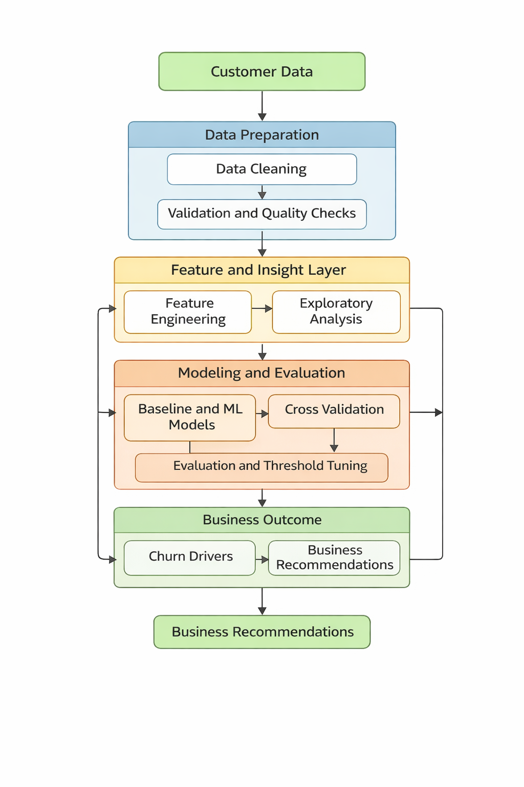

# Customer Churn Prediction and Analysis

## Overview

This project focuses on identifying customers at risk of churn using behavioural, transactional, and engagement data.

The problem is treated as a **binary classification task**, where the target variable represents whether a customer is at risk of churn (1) or not (0). The goal is not only to achieve strong predictive performance but also to extract **actionable business insights**.

---

## 📊 Project Workflow

The solution follows a structured end-to-end pipeline, starting from data preparation and feature engineering through to modelling, evaluation, and business recommendations.



<p align="center"><i>End-to-end churn prediction workflow</i></p>

Key stages include:
- Data cleaning and validation to ensure reliable inputs  
- Feature engineering capturing behavioural and transactional signals  
- Exploratory analysis to understand customer segments and trends  
- Model development and benchmarking across multiple algorithms  
- Evaluation using classification metrics and threshold analysis  
- Translation of model outputs into business recommendations  

---

## ⚙️ Approach

### Data Preparation
- Handling missing values and placeholder entries  
- Cleaning invalid or inconsistent numeric values  
- Validating data ranges and distributions  

### Feature Engineering
- Behavioural features such as engagement and login patterns  
- Transaction-based features including wallet balance and value per activity  
- Complaint-related features capturing customer experience signals  
- Tenure and cohort-based features  

### Exploratory Analysis
- Churn patterns across customer segments  
- Cohort and tenure analysis  
- Distribution of key numeric drivers  

### Modelling
The problem is approached using multiple machine learning models:

- Logistic Regression (baseline)  
- Random Forest  
- Gradient Boosting  
- XGBoost (benchmark model)  

Evaluation metrics include:
- F1 Score  
- Precision and Recall  
- ROC-AUC  

Threshold sensitivity analysis is also performed to support decision-making.

---

## Key Drivers of Churn

The model identifies the most influential predictors of customer churn based on feature importance analysis:


<p align="center"><i>Top features driving churn predictions</i></p>

The strongest signals include:
- Membership category
- Wallet balance (points_in_wallet)
- Transaction value patterns
- Engagement and login behaviour

---

## Model Performance

The selected model demonstrates strong predictive performance on held-out test data:


<p align="center"><i>ROC curve showing model discrimination ability</i></p>

---

## Cohort Analysis

Churn rates vary across customer cohorts based on their joining month:


<p align="center"><i>Churn rate by customer acquisition cohort</i></p>

*Note: This chart reflects differences across customer cohorts based on their joining month, not a true time-based churn trend. It indicates whether customers who joined during certain periods exhibit different churn behavior.*

---

## Key Results

- Gradient Boosting and XGBoost achieved strong predictive performance  
- The most influential signals include:
  - Membership category  
  - Wallet balance  
  - Transaction value  
- Behavioural and complaint-related features provide additional context  

---

## Business Insights

The model highlights several patterns associated with higher churn risk:

- Customers in certain membership categories  
- Customers with lower wallet balances and transaction activity  
- Customers showing reduced engagement signals  

These insights can support targeted retention strategies such as:
- Proactive engagement campaigns  
- Incentive-based retention offers  
- Prioritisation of high-risk customer segments  

---

## Limitations

- The dataset is static and does not capture true temporal churn events  
- Some features may not be available in real-time scoring scenarios  
- Model outputs are predictive and not causal  
- Further validation is required before production deployment

## Environment Setup

Create a virtual environment and install dependencies:

```bash
python -m venv .venv
source .venv/bin/activate   # Windows: .venv\Scripts\activate
pip install -r requirements.txt
```

## How to Run

Run the analysis script:

```bash
python churn_analysis.py
```

Alternatively, open and run the Jupyter notebook:

```bash
jupyter notebook churn_analysis.ipynb
```

## Project Structure

```
churn-prediction-gs/
├── data/
│   └── churn.csv           # Customer data
├── images/
│   ├── workflow.png        # Pipeline diagram
│   ├── feature_importance.png  # Generated by analysis
│   └── roc_curve.png       # Generated by analysis
├── churn_analysis.py       # Main analysis script
├── churn_analysis.ipynb    # Jupyter notebook version
├── requirements.txt        # Python dependencies
└── README.md              # Project documentation
```
